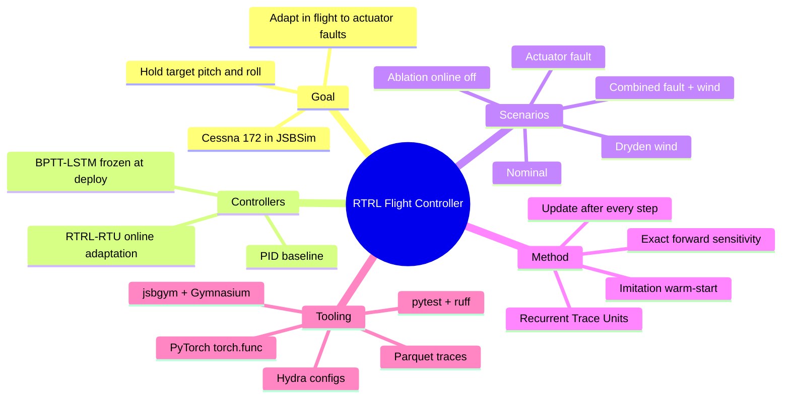
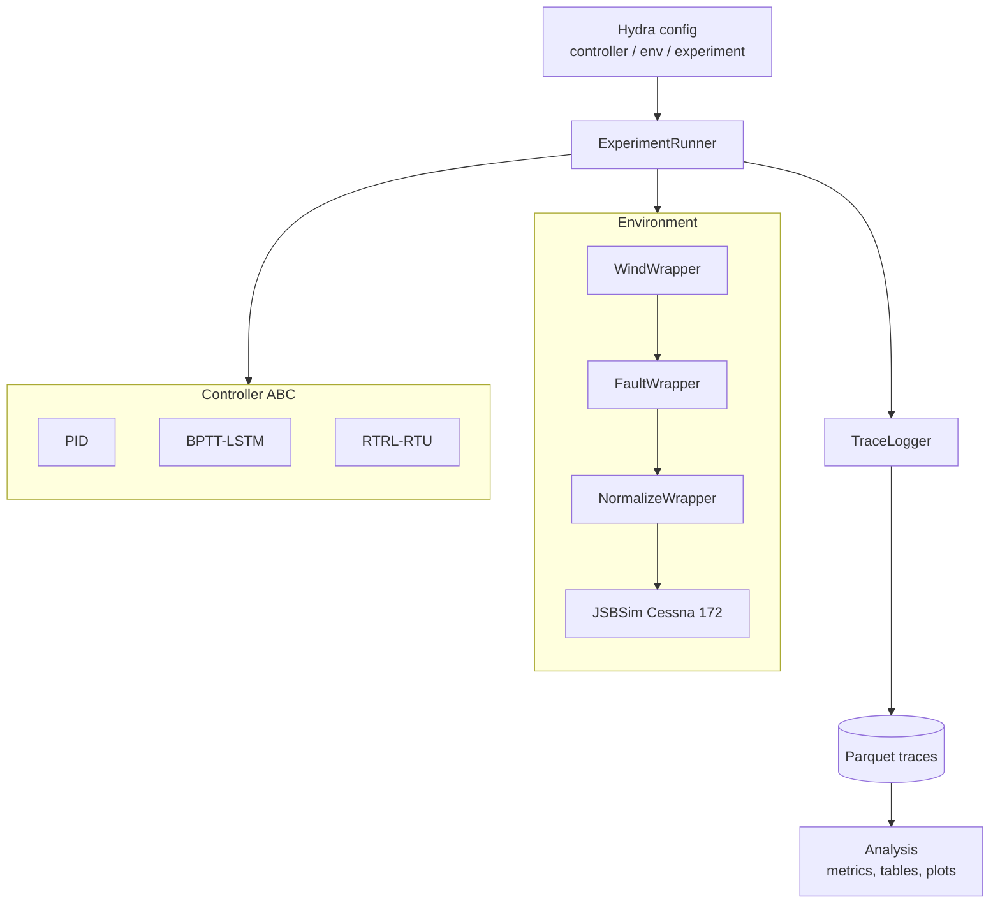
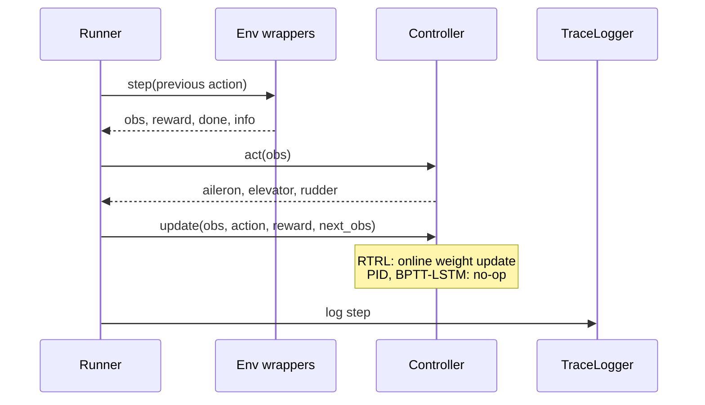
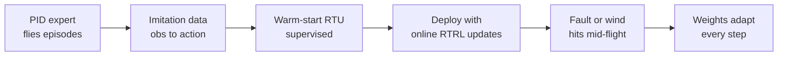
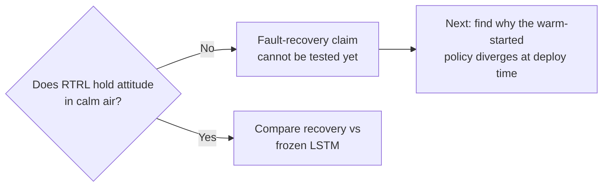

# RTRL Flight Surface Controller

A flight controller for a Cessna 172 in JSBSim that predicts aileron, elevator and rudder deflections to hold a target attitude (pitch and roll).
It uses Real-Time Recurrent Learning (RTRL) with Recurrent Trace Units to adapt its weights in flight, aiming to recover from actuator faults.
It is benchmarked against PID and BPTT-LSTM baselines under nominal, fault, wind and combined scenarios.

## Project at a glance



## Why RTRL?

A normal recurrent network is trained offline with backpropagation through time (BPTT), then its weights are frozen. If an actuator degrades mid-flight, the frozen network cannot react. RTRL carries the gradient of the hidden state with respect to every weight forward in time, so the weights can be updated after every simulation step.

| | PID | BPTT-LSTM | RTRL-RTU |
|---|---|---|---|
| Learned | No | Yes, offline | Yes, offline warm-start then online |
| Weights change in flight | No (fixed gains) | No (frozen) | Yes, every step |
| Needs training data | No | Yes (imitation) | Yes (imitation warm-start) |
| Can react to a fault | Only through feedback | Only through its state | Through feedback and weight updates |

Naive RTRL costs O(N^3) per step for a dense recurrence, which is why it is rarely used. Recurrent Trace Units use a diagonal recurrence, so each unit's sensitivity stays local and exact RTRL costs about as much as a forward pass. No approximation is used.

## System architecture



Per-step loop in the runner:



## Training pipeline for the RTRL controller



Cold-start online RTRL on flight dynamics diverges, so the imitation warm-start is required.

## Experiments

| # | Scenario | What changes | What it tests |
|---|---|---|---|
| 1 | Nominal | Calm air, no fault | Controllers match a PID baseline |
| 2 | Fault | Aileron, elevator or rudder degraded mid-episode | Recovery of RTRL vs frozen baselines |
| 3 | Wind | Dryden turbulence at several severities | Robustness to unseen disturbance |
| 4 | Combined | Fault and wind together | Headline stress test |
| 5 | Ablation | RTRL with online updates off | Whether online learning causes any gain |

Metrics: attitude tracking RMSE, settling time, control jerk, and time to recover after a fault.

## Results

3 seeds per cell. Attitude RMSE in rad, lower is better.

| Scenario | PID | BPTT-LSTM | RTRL-RTU |
|---|---|---|---|
| Nominal | **0.175** | 0.319 | 1.582 |
| Fault | **0.222** | 0.545 | 1.534 |
| Wind | **0.205** | 0.332 | 1.598 |
| Combined | **0.253** | 0.470 | 1.693 |
| Ablation (RTRL, online off) | n/a | n/a | 2.048 |

### What the results mean

| Finding | Evidence |
|---|---|
| PID is the strongest controller | Lowest RMSE in all four scenarios |
| Frozen BPTT-LSTM is a credible learned baseline | About 2x PID's error, stable |
| The RTRL controller does not yet work | RMSE about 1.6 rad even in calm air |
| Fault recovery is untested, not disproved | RTRL was already failing before the fault |
| Ablation is inconclusive | 3 seeds, very high variance, both settings poor |



The full write-up is in `report/`.

## Setup

Requires Python 3.11 and [uv](https://docs.astral.sh/uv/).

```bash
uv sync --extra dev
```

## Usage

| Command | Purpose |
|---|---|
| `python scripts/train_bptt.py` | Train the BPTT-LSTM baseline |
| `python scripts/train_rtrl_warmstart.py` | Imitation warm-start for RTRL |
| `python scripts/tune_pid.py` | Tune PID gains |
| `python scripts/run_experiment.py` | Run one experiment from a Hydra config |
| `python scripts/run_sweep.py` | Full scenario x controller x seed sweep |
| `python scripts/run_ablation.py` | RTRL with online updates disabled |
| `python scripts/make_plots.py` | Parquet traces to figures |
| `python scripts/live_demo.py` | Live demo |
| `pytest` | Tests, including the RTRL sensitivity check |

## Repository layout

| Path | Contents |
|---|---|
| `src/rtrl_flight/env/` | JSBSim task, reward, fault/wind/normalize/trace wrappers |
| `src/rtrl_flight/controllers/` | PID, BPTT-LSTM, RTRL-RTU (all implement the `Controller` ABC) |
| `src/rtrl_flight/rtrl/` | RTU cell, forward sensitivity, warm-start |
| `src/rtrl_flight/training/` | Imitation and online training loops |
| `src/rtrl_flight/metrics/` | Tracking, smoothness, recovery |
| `src/rtrl_flight/analysis/` | Aggregation and plots |
| `scripts/` | Thin CLI entrypoints |
| `configs/` | Hydra configs for controllers, envs and experiments |
| `tests/` | pytest suite |
| `agent_docs/` | Design docs: architecture, RTRL math, experiments |
| `report/` | Written report, figures, tables |

## Design rules

| Rule | Why |
|---|---|
| Every controller implements `act`, `update`, `reset`, `save`, `load` | The runner never checks controller types |
| Faults and wind are composable Gymnasium wrappers | `WindWrapper(FaultWrapper(env))` works in any order |
| RTRL's online step is `controller.update()` | PID and BPTT-LSTM make it a no-op, so the ablation needs no branching |
| Analysis reads parquet traces only | Runs and plots are decoupled |
| One Hydra config per experiment | Reproducible runs |
| `tests/test_rtrl_sensitivity.py` must pass | It checks the sensitivity against finite differences; without it this is not exact RTRL |

## References

- Irie et al., ICLR 2024 (Recurrent Trace Units)
- Elelimy et al., NeurIPS 2024 (real-time recurrent learning with RTUs)

See `agent_docs/` for the full design.
